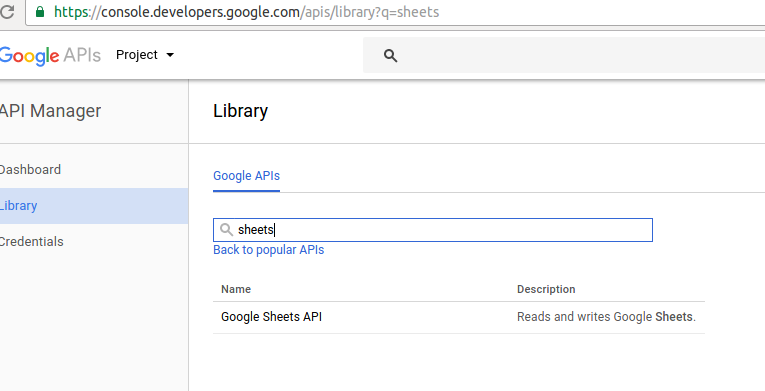
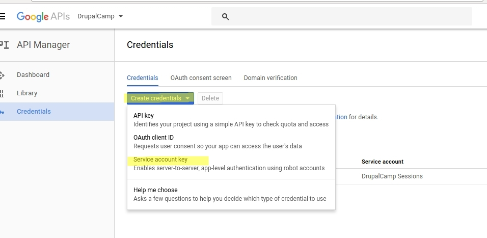
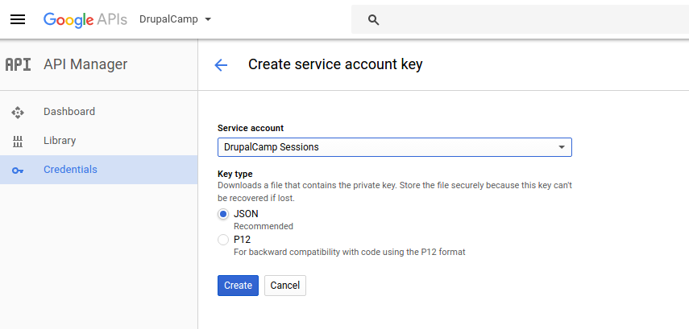
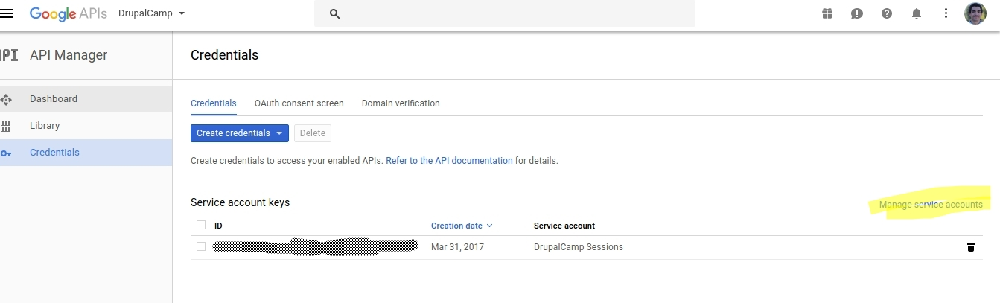
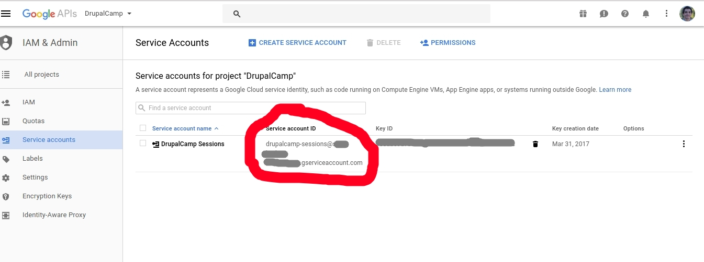

# Acquire credentials

Start by creating a service account at the Google Developer Console:

1. Open https://console.developers.google.com/apis/library

2. Enable it and create a project:

3. At Credentials, create a service account:

4. Keep defaults at the next form and click Create. Save the resulting private key file in a directory where your application can read it:

5. Next, click on “Manage Service accounts”:

6. Copy the email address of your service account:

7. Grant permission to the service account to the spreadsheet:

8. Store the private key in `secret.json` (you also can choose another name and specify the path)